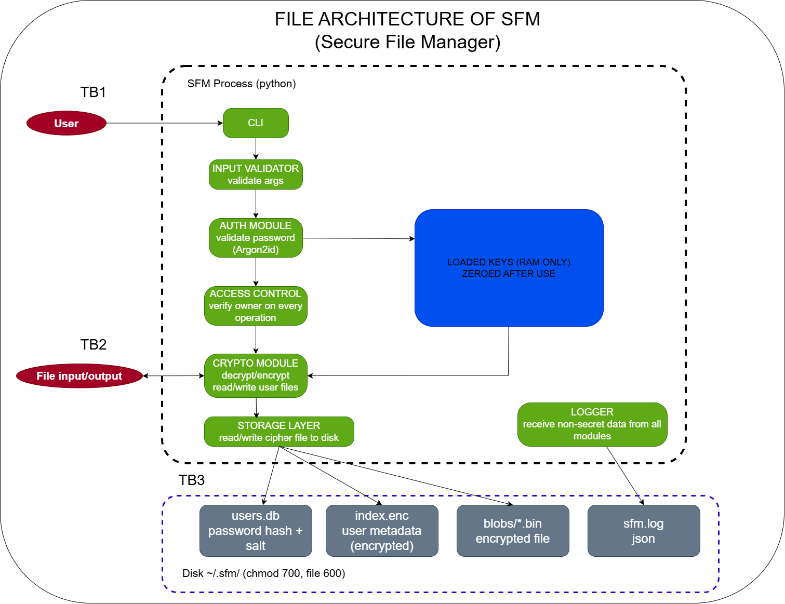

# Secure File Manager (`sfm`)
A local command-line tool that encrypts, stores, retrieves and securely deletes files in a per-user encrypted vault. 

> **Status:** Checkpoint 1 (design and repository setup)

## Scope

**In scope**

- Multi-user vault on a single machine: several accounts can use the same installation, each with private storage.
- Authenticated encryption of files (AES-256-GCM)
- Password authentication with Argon2id and a per-user random salt.
- Encrypted metadata (file names, owners, keys), so the vault directory reveals nothing about its content.
- Input validation and sanitisation (paths, arguments, passwords).
- Structured logging without secrets and generic user-facing errors.

**Out of scope**

- Any network component: this is a local tool
- Attackers with root or malware running as the same user while the vault is unlocked or any hardware attacks.
- Password recovery: a lost password means lost data, by design.
- Guaranteed memory wiping and guaranteed secure deletion on SSD

Threat model, architecture diagram and trust boundaries:



Full architecture, trust boundaries and threat model: see the design document submitted for Checkpoint 1.
## Planned commands

The user is identified with `--user`. The password is asked at every invocation (no persistent session).

| Command | Description |
|---|---|
| `sfm register <username>` | Create a new user and an empty encrypted vault |
| `sfm --user <name> encrypt <path> [--remove-original]` | Encrypt a file into the vault and print its ID; optionally delete the plaintext original securely |
| `sfm --user <name> decrypt <id> -o <dest> [--force]` | Decrypt a vault file to `<dest>`; refuses to overwrite unless `--force` |
| `sfm --user <name> list` | List the user's own files (ID, original name, date) |
| `sfm --user <name> delete <id>` | Delete a file and destroy its key |
| `sfm --user <name> passwd` | Change the password (re-encrypts the index only) |
| `sfm --help` | Show usage |

Example:

```bash
sfm register alice
sfm --user alice encrypt ~/documents/thesis.pdf
sfm --user alice list
sfm --user alice decrypt 7 -o ~/restored/thesis.pdf
sfm --user alice delete 7
```

## Requirements

- Python 3.11 or newer
- Linux (developed and tested on Linux). Not tested on Windows or macOS.
- No compiler needed

## Build and run

```bash
git clone <repository-url> secure-file-manager
cd secure-file-manager

python3 -m venv .venv
source .venv/bin/activate            

pip install -r requirements.txt

```


Data is stored in `~/.sfm/` (directories `700`, files `600`).

## Repository layout

```
secure-file-manager/
├── .gitignore
├── README.md
├── requirements.txt
└── docs/
    └── architecture.png
```

## Dependencies

- [`cryptography`](https://cryptography.io/): AES-256-GCM, HKDF
- [`argon2-cffi`](https://argon2-cffi.readthedocs.io/): Argon2id password hashing and key derivation
- Standard library: `argparse`, `getpass`, `pathlib`, `sqlite3`, `logging`


## Author

Tommaso, 265856IVCM. Course: ICS0022 Secure Programming, 2026/2027 autumn semester.
